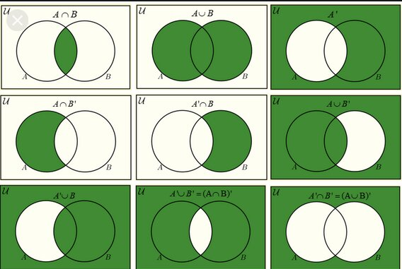
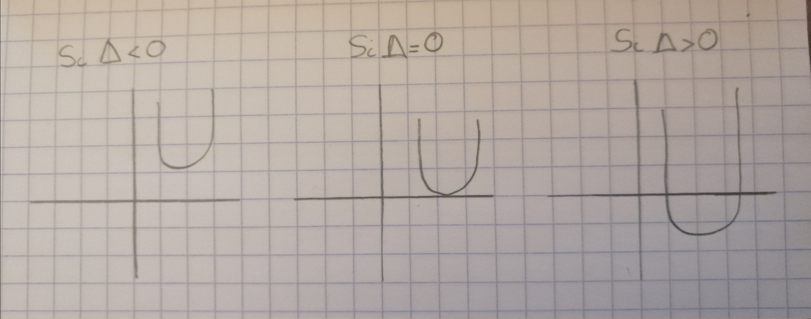
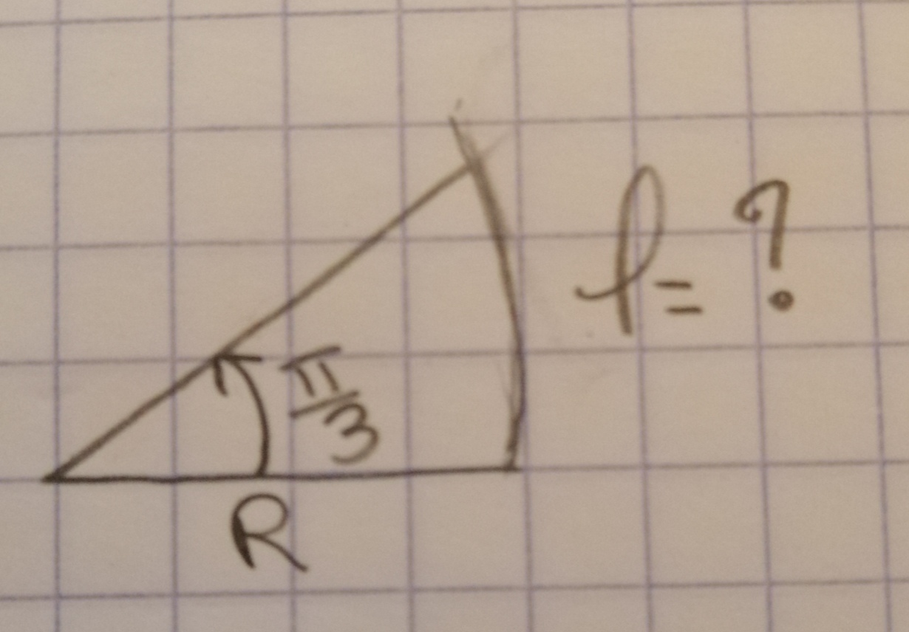
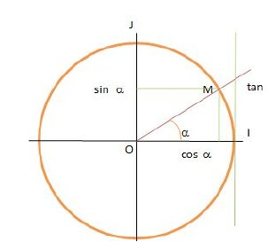
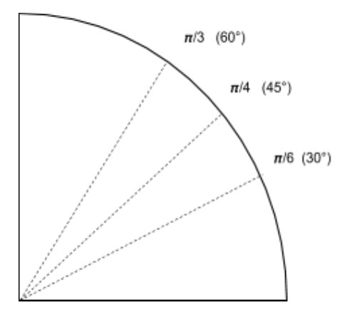
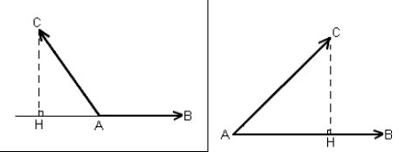

---
author:
- Nicolas Vadkerti
title: Revision
---

Notation
========

$$\label{xx}
\begin{split}
&f = [ \mathbb{R}^{*}_{+}\Rightarrow\mathbb{R}] \\
&x\ \mapsto \ln(x)\\
\end{split}$$

Les Ensemles
------------

Notation pour les ensembles\
$\mathbb{R}\rightarrow$les reel\
$\mathbb{R}^{*}\rightarrow$Tous sauf 0\
$\mathbb{R}^{*}_{+} \rightarrow$Tous les reels positif sauf 0\
$A\cap B \rightarrow$Tous les nombres dans l'ensembles A et B en même
temps\
$A\cup B \rightarrow$ Tous les nombres compris dans A et B

{#fig:net}

\
$\forall \rightarrow$ Pour tous\
$\exists \rightarrow$ Il existe\
$\Rightarrow\rightarrow$ "implique" : Si A est Vrai alors B est vrai,
donc si A Faux, alors B aussi\
$\Leftrightarrow \rightarrow$ equivalence : Si A $\Leftrightarrow$ B
alors A$\Rightarrow$ B et B$\Rightarrow$A

Fonctions Références
====================

-   ln, log(x)\
    $\ln(e)=1$\
    $\ln(1)=0$\
    $\ln(x.y)=ln(x)+ln(y)\Rightarrow\ln(x^y)=y\ln(x)$\
    $log_{10}(x)=\frac{ln(x)}{ln(10}$\
    Exemple:\
    $log_{10}(1000)=log_{10}(10^3)=3\frac{ln(10)}{ln(10)}=3$\

-   exp(x)\
    $e^{x+y}=e^x.e^y$\
    $ln(e^x)=x$

-   sin, cos, tan

-   Les polynomes\
    $$\label{xx}
    \begin{split}
    &f(x)=x^2+x+n\\
    \end{split}$$

-   La fonction inverse : $\frac{1}{x}$

-   Les Equations Linaires

Les équations Linéaires
=======================

$$\label{xx}
\begin{split}
&f = [ \mathbb{R}\rightarrow\mathbb{R}] \\
&x\ \mapsto ax+b \\
\end{split}$$

{#fig:net}

Les identités remarquables
==========================

-   $(a+b)^2= a^2+b^2+ 2ab$

-   $(a-b)^2 =a^2+b^2-2ab$

-   $(a+b)(a-b) = a^2-b^2$

Resolution de polynomes de degré 2
==================================

Méthode
-------

$f(x)=ax^2+bx+c$\
Calcul du $\Delta$:\
$b^2-4ac$\
Si $\Delta <0$ L'equation n'admet aucune soltion dans $\mathbb{R}$\
Si $\Delta =0$ L'equation admet comme unique solution $x=\frac{-b}{2a}$\
Si $\Delta >0$ L'equation 2 solutions $x^1$ et $x^2$ où
$x^1= \frac{-b+\sqrt[]{\Delta}}{2a}$ et
$x^2= \frac{-b-\sqrt[]{\Delta}}{2a}$

{#fig:net}

Les Puissances 
==============

$a^x . a^y =a^{x+y}$\
$\ a^x+a^y\neq a^{x+y}$\

La trigonometrie
================

{#fig:net}

$l=\frac{\pi}{3}.R$\
donc $l=angle.rayon$

Le cercle unitaire
------------------

Definition: Un cercle de rayon 1\

{#fig:net}

Formule de trigonometrie
------------------------

Formule à connaitre!!!!! (cahsohtoa)\

-   $cos(\theta)=\frac{adj}{hyp}$\

-   $sin(\theta)=\frac{opp}{hyp}$\

-   $tan(\theta)=\frac{sin(\theta)}{cos(\theta)}=\frac{opp}{adj}$

{#fig:net}

Les valeurs Importants
----------------------

{#fig:net}

Les valeurs des tangentes sont facile à retrouver grâce à
$\frac{sin(\theta)}{cos(\theta)}=tan(\theta)$

Les formules de trigonometrie volume 2
--------------------------------------

$cos(a+b)=cos(a).cos(b)-sin(a)sin(b)$ ("coco" moins "sisi")\
$sin(a+b)= sin(a).cos(b) + cos(a).sin(b)$ ("sico" plus "cosi")\
-----\
$cos(a-b)=cos(a).cos(b) + sin(a)sin(b)$ (avec le cos, le signe change,
pas la fonction)\
$sin(a-b)= sin(a).cos(b) - cos(a).sin(b)$(avec le sin, le signe change
pas, mais la fonction oui)\

La formule d'Euler (De l'air)
=============================

Wikipedia nous dit: Les formules d'Euler relient les fonctions
trigonométriques à l'exponentielle complexe. Ces formules permettent de
linéariser cos(nx) et sin(nx), c'est-à-dire d'exprimer ces quantités en
fonction de cos(px) et sin(px).\
$cos(\theta)=\frac{e^{i\theta}+e^{-i\theta}}{2}$\
$sin(\theta)=\frac{e^{i\theta}-e^{-i\theta}}{2i}$

Si on veut dévelloper : $cos^4(\theta)=\frac{(e^{io}+e^{-io})^4}{16}$

Comment dévelloper $(a+b)^n$
----------------------------

Deja, on prend le triangle de Pascal :\
1 (n=0)\
11(n=1)\
121(n=2)\
1331(n=3)\
14641(n=4)\
Puis par construction on peut ecrire pour n = 4 par exemple :
$1a^?b^? + 4a^?b^? + 6a^?b^?+4a^?b^?+1a^?b^?$\
Pour déterminer les puissances rien de plus simple :
$1a^{n}b^{n-n} + 4a^{n-1}b^{n-(1+n)} + 6a^{n-2}b^{n-(n+2}+4a^{n-3}b^{n-(n+3)}+1a^{n-4}b^{n-(n+4)}$\
donc dans les faits on a: $a^4+4a^3b+6a^2b^2+4ab^3+b^4$

On revient à $cos^4(\theta)=\frac{(e^{io}+e^{-io})^4}{16}$
----------------------------------------------------------

$cos^4(\theta)=\frac{(e^{i\theta})^4+4(e^{i\theta})^3(e^{-i\theta})^1+6(e^{i\theta})^2(e^{-i\theta})^2+4(e^{i\theta})^1(e^{-i\theta})^3+(e^{-i\theta})^4}{16}$\
$=\frac{1}{8}cos(4\theta)+\frac{6}{16}+\frac{4}{8}cos(2\theta)$\
$=\frac{1}{8}cos(4\theta)+\frac{3}{8}+\frac{1}{2}cos(2\theta)$

Geometrie
=========

Un repère : Un point ; l'origine + n.vecteur (ou n nombre de dimension)\
Dès que l'on a des vecteurs, et un point m(3;2), on peut ecrire
$\vbox{\halign{##\cr 
  \tiny\rightarrowfill\cr\noalign{\nointerlineskip\vskip 1pt} 
  $OM\mskip 2mu$\cr}}= 3.\vbox{\halign{##\cr 
  \tiny\rightarrowfill\cr\noalign{\nointerlineskip\vskip 1pt} 
  $i\mskip 2mu$\cr}}+2\vbox{\halign{##\cr 
  \tiny\rightarrowfill\cr\noalign{\nointerlineskip\vskip 1pt} 
  $j\mskip 2mu$\cr}}$

Si M(3;2) et N (4;3) $\Rightarrow \vbox{\halign{##\cr 
  \tiny\rightarrowfill\cr\noalign{\nointerlineskip\vskip 1pt} 
  $MN\mskip 2mu$\cr}}=(4-3;7-2)=(1;5)$

Norme d'un vecteur: Cela correspond à la "longueur" d'un vecteur que
l'on notera $\left\lVert\vbox{\halign{##\cr 
  \tiny\rightarrowfill\cr\noalign{\nointerlineskip\vskip 1pt} 
  $OM\mskip 2mu$\cr}}\right\rVert$

Relation de Chasles: $\vbox{\halign{##\cr 
  \tiny\rightarrowfill\cr\noalign{\nointerlineskip\vskip 1pt} 
  $NM\mskip 2mu$\cr}}+\vbox{\halign{##\cr 
  \tiny\rightarrowfill\cr\noalign{\nointerlineskip\vskip 1pt} 
  $MK\mskip 2mu$\cr}}=\vbox{\halign{##\cr 
  \tiny\rightarrowfill\cr\noalign{\nointerlineskip\vskip 1pt} 
  $NK\mskip 2mu$\cr}} \ \forall N,M,K$

Théoreme du barycentre : de M, coefficient 3, N, coefficient 1, et K
coefficient 7, alors\
barycentre de $(M;3),(N;1),(K;7)\Leftrightarrow 3.\vbox{\halign{##\cr 
  \tiny\rightarrowfill\cr\noalign{\nointerlineskip\vskip 1pt} 
  $GM\mskip 2mu$\cr}}+1.\vbox{\halign{##\cr 
  \tiny\rightarrowfill\cr\noalign{\nointerlineskip\vskip 1pt} 
  $GN\mskip 2mu$\cr}}+7.\vbox{\halign{##\cr 
  \tiny\rightarrowfill\cr\noalign{\nointerlineskip\vskip 1pt} 
  $GK\mskip 2mu$\cr}} = \vbox{\halign{##\cr 
  \tiny\rightarrowfill\cr\noalign{\nointerlineskip\vskip 1pt} 
  $0\mskip 2mu$\cr}}$\
$= 3(\vbox{\halign{##\cr 
  \tiny\rightarrowfill\cr\noalign{\nointerlineskip\vskip 1pt} 
  $GO\mskip 2mu$\cr}}+\vbox{\halign{##\cr 
  \tiny\rightarrowfill\cr\noalign{\nointerlineskip\vskip 1pt} 
  $OM\mskip 2mu$\cr}})+\vbox{\halign{##\cr 
  \tiny\rightarrowfill\cr\noalign{\nointerlineskip\vskip 1pt} 
  $GO\mskip 2mu$\cr}}+\vbox{\halign{##\cr 
  \tiny\rightarrowfill\cr\noalign{\nointerlineskip\vskip 1pt} 
  $ON\mskip 2mu$\cr}}+7(\vbox{\halign{##\cr 
  \tiny\rightarrowfill\cr\noalign{\nointerlineskip\vskip 1pt} 
  $GO\mskip 2mu$\cr}}+\vbox{\halign{##\cr 
  \tiny\rightarrowfill\cr\noalign{\nointerlineskip\vskip 1pt} 
  $OK\mskip 2mu$\cr}}=\vbox{\halign{##\cr 
  \tiny\rightarrowfill\cr\noalign{\nointerlineskip\vskip 1pt} 
  $0\mskip 2mu$\cr}}$\
$=11\vbox{\halign{##\cr 
  \tiny\rightarrowfill\cr\noalign{\nointerlineskip\vskip 1pt} 
  $GO\mskip 2mu$\cr}}+3\vbox{\halign{##\cr 
  \tiny\rightarrowfill\cr\noalign{\nointerlineskip\vskip 1pt} 
  $OM\mskip 2mu$\cr}}+\vbox{\halign{##\cr 
  \tiny\rightarrowfill\cr\noalign{\nointerlineskip\vskip 1pt} 
  $ON\mskip 2mu$\cr}}+7\vbox{\halign{##\cr 
  \tiny\rightarrowfill\cr\noalign{\nointerlineskip\vskip 1pt} 
  $OK\mskip 2mu$\cr}}=\vbox{\halign{##\cr 
  \tiny\rightarrowfill\cr\noalign{\nointerlineskip\vskip 1pt} 
  $0\mskip 2mu$\cr}}$\
$=\vbox{\halign{##\cr 
  \tiny\rightarrowfill\cr\noalign{\nointerlineskip\vskip 1pt} 
  $OG\mskip 2mu$\cr}}=\frac{3\vbox{\halign{##\cr 
  \tiny\rightarrowfill\cr\noalign{\nointerlineskip\vskip 1pt} 
  $OM\mskip 2mu$\cr}}+\vbox{\halign{##\cr 
  \tiny\rightarrowfill\cr\noalign{\nointerlineskip\vskip 1pt} 
  $ON\mskip 2mu$\cr}}+7\vbox{\halign{##\cr 
  \tiny\rightarrowfill\cr\noalign{\nointerlineskip\vskip 1pt} 
  $OK\mskip 2mu$\cr}}}{11}$\
Donc $\vbox{\halign{##\cr 
  \tiny\rightarrowfill\cr\noalign{\nointerlineskip\vskip 1pt} 
  $OG\mskip 2mu$\cr}} = \frac{3}{11}(X_M;Y_M)+\frac{1}{11}(X_N;Y_N)+\frac{7}{11}(X_K;Y_K)$

Les operations definies sur les vecteurs
----------------------------------------

Il y'a plusieurs operations defini:\
L'addition de $\vbox{\halign{##\cr 
  \tiny\rightarrowfill\cr\noalign{\nointerlineskip\vskip 1pt} 
  $vecteur\mskip 2mu$\cr}}$\
Le Produit externe: $\mathbb{R}. \vbox{\halign{##\cr 
  \tiny\rightarrowfill\cr\noalign{\nointerlineskip\vskip 1pt} 
  $vecteur\mskip 2mu$\cr}}= \vbox{\halign{##\cr 
  \tiny\rightarrowfill\cr\noalign{\nointerlineskip\vskip 1pt} 
  $UnVecteur\mskip 2mu$\cr}}$\
Le Produit scalaire: $\vbox{\halign{##\cr 
  \tiny\rightarrowfill\cr\noalign{\nointerlineskip\vskip 1pt} 
  $vecteur\mskip 2mu$\cr}} . \vbox{\halign{##\cr 
  \tiny\rightarrowfill\cr\noalign{\nointerlineskip\vskip 1pt} 
  $vecteur\mskip 2mu$\cr}} = \mathbb{R}$\
Le Produit vectoriel: $\vbox{\halign{##\cr 
  \tiny\rightarrowfill\cr\noalign{\nointerlineskip\vskip 1pt} 
  $vecteur\mskip 2mu$\cr}} . \vbox{\halign{##\cr 
  \tiny\rightarrowfill\cr\noalign{\nointerlineskip\vskip 1pt} 
  $vecteur\mskip 2mu$\cr}} =\vbox{\halign{##\cr 
  \tiny\rightarrowfill\cr\noalign{\nointerlineskip\vskip 1pt} 
  $UnVecteur\mskip 2mu$\cr}}$

### Le produit scalaire

{#fig:net}

$\vbox{\halign{##\cr 
  \tiny\rightarrowfill\cr\noalign{\nointerlineskip\vskip 1pt} 
  $AB\mskip 2mu$\cr}}.\vbox{\halign{##\cr 
  \tiny\rightarrowfill\cr\noalign{\nointerlineskip\vskip 1pt} 
  $AC\mskip 2mu$\cr}}= AH$\
$\vbox{\halign{##\cr 
  \tiny\rightarrowfill\cr\noalign{\nointerlineskip\vskip 1pt} 
  $AB\mskip 2mu$\cr}}.\vbox{\halign{##\cr 
  \tiny\rightarrowfill\cr\noalign{\nointerlineskip\vskip 1pt} 
  $AC\mskip 2mu$\cr}}\neq \vbox{\halign{##\cr 
  \tiny\rightarrowfill\cr\noalign{\nointerlineskip\vskip 1pt} 
  $AC\mskip 2mu$\cr}}.\vbox{\halign{##\cr 
  \tiny\rightarrowfill\cr\noalign{\nointerlineskip\vskip 1pt} 
  $AB\mskip 2mu$\cr}}$\
Forme générale: $\vbox{\halign{##\cr 
  \tiny\rightarrowfill\cr\noalign{\nointerlineskip\vskip 1pt} 
  $u\mskip 2mu$\cr}}\vbox{\halign{##\cr 
  \tiny\rightarrowfill\cr\noalign{\nointerlineskip\vskip 1pt} 
  $v\mskip 2mu$\cr}}=\left\lVert\vbox{\halign{##\cr 
  \tiny\rightarrowfill\cr\noalign{\nointerlineskip\vskip 1pt} 
  $u\mskip 2mu$\cr}}\right\rVert.\left\lVert\vbox{\halign{##\cr 
  \tiny\rightarrowfill\cr\noalign{\nointerlineskip\vskip 1pt} 
  $v\mskip 2mu$\cr}}\right\rVert.cos(\vbox{\halign{##\cr 
  \tiny\rightarrowfill\cr\noalign{\nointerlineskip\vskip 1pt} 
  $u\mskip 2mu$\cr}},\vbox{\halign{##\cr 
  \tiny\rightarrowfill\cr\noalign{\nointerlineskip\vskip 1pt} 
  $v\mskip 2mu$\cr}})$\
Donc si $\vbox{\halign{##\cr 
  \tiny\rightarrowfill\cr\noalign{\nointerlineskip\vskip 1pt} 
  $u\mskip 2mu$\cr}}.\vbox{\halign{##\cr 
  \tiny\rightarrowfill\cr\noalign{\nointerlineskip\vskip 1pt} 
  $u\mskip 2mu$\cr}}= \left\lVert\vbox{\halign{##\cr 
  \tiny\rightarrowfill\cr\noalign{\nointerlineskip\vskip 1pt} 
  $u\mskip 2mu$\cr}}\right\rVert.\left\lVert\vbox{\halign{##\cr 
  \tiny\rightarrowfill\cr\noalign{\nointerlineskip\vskip 1pt} 
  $u\mskip 2mu$\cr}}\right\rVert.cos(\vbox{\halign{##\cr 
  \tiny\rightarrowfill\cr\noalign{\nointerlineskip\vskip 1pt} 
  $u\mskip 2mu$\cr}},\vbox{\halign{##\cr 
  \tiny\rightarrowfill\cr\noalign{\nointerlineskip\vskip 1pt} 
  $u\mskip 2mu$\cr}})$\
$=\left\lVert\vbox{\halign{##\cr 
  \tiny\rightarrowfill\cr\noalign{\nointerlineskip\vskip 1pt} 
  $u\mskip 2mu$\cr}}\right\rVert.\left\lVert\vbox{\halign{##\cr 
  \tiny\rightarrowfill\cr\noalign{\nointerlineskip\vskip 1pt} 
  $u\mskip 2mu$\cr}}\right\rVert.cos{0}$\
$=\left\lVert\vbox{\halign{##\cr 
  \tiny\rightarrowfill\cr\noalign{\nointerlineskip\vskip 1pt} 
  $u\mskip 2mu$\cr}}\right\rVert^2.1$\
$=\left\lVert\vbox{\halign{##\cr 
  \tiny\rightarrowfill\cr\noalign{\nointerlineskip\vskip 1pt} 
  $u\mskip 2mu$\cr}}\right\rVert^2$\
La distributivité fonctionne:\
$\vbox{\halign{##\cr 
  \tiny\rightarrowfill\cr\noalign{\nointerlineskip\vskip 1pt} 
  $u\mskip 2mu$\cr}}.(\vbox{\halign{##\cr 
  \tiny\rightarrowfill\cr\noalign{\nointerlineskip\vskip 1pt} 
  $v\mskip 2mu$\cr}}+\vbox{\halign{##\cr 
  \tiny\rightarrowfill\cr\noalign{\nointerlineskip\vskip 1pt} 
  $w\mskip 2mu$\cr}})=\vbox{\halign{##\cr 
  \tiny\rightarrowfill\cr\noalign{\nointerlineskip\vskip 1pt} 
  $u\mskip 2mu$\cr}}.\vbox{\halign{##\cr 
  \tiny\rightarrowfill\cr\noalign{\nointerlineskip\vskip 1pt} 
  $v\mskip 2mu$\cr}}+\vbox{\halign{##\cr 
  \tiny\rightarrowfill\cr\noalign{\nointerlineskip\vskip 1pt} 
  $u\mskip 2mu$\cr}}.\vbox{\halign{##\cr 
  \tiny\rightarrowfill\cr\noalign{\nointerlineskip\vskip 1pt} 
  $w\mskip 2mu$\cr}}$ Quand on a les coordonnées des points, on s'embète
pas :\
$(x;y).(x';y')=xx'+yy'$\
A noter que si $\vbox{\halign{##\cr 
  \tiny\rightarrowfill\cr\noalign{\nointerlineskip\vskip 1pt} 
  $u\mskip 2mu$\cr}}\perp\vbox{\halign{##\cr 
  \tiny\rightarrowfill\cr\noalign{\nointerlineskip\vskip 1pt} 
  $v\mskip 2mu$\cr}} \Rightarrow \vbox{\halign{##\cr 
  \tiny\rightarrowfill\cr\noalign{\nointerlineskip\vskip 1pt} 
  $u\mskip 2mu$\cr}}.\vbox{\halign{##\cr 
  \tiny\rightarrowfill\cr\noalign{\nointerlineskip\vskip 1pt} 
  $v\mskip 2mu$\cr}}=0$

### La Norme

$||(x;y)||=\sqrt{x^2+y^2}$

### Le produit Vectoriel

$\vbox{\halign{##\cr 
  \tiny\rightarrowfill\cr\noalign{\nointerlineskip\vskip 1pt} 
  $u\mskip 2mu$\cr}}\land\vbox{\halign{##\cr 
  \tiny\rightarrowfill\cr\noalign{\nointerlineskip\vskip 1pt} 
  $v\mskip 2mu$\cr}}=\vbox{\halign{##\cr 
  \tiny\rightarrowfill\cr\noalign{\nointerlineskip\vskip 1pt} 
  $w\mskip 2mu$\cr}}$\
avec $\vbox{\halign{##\cr 
  \tiny\rightarrowfill\cr\noalign{\nointerlineskip\vskip 1pt} 
  $w\mskip 2mu$\cr}}$ un vecteur perpendiculaire à $\vbox{\halign{##\cr 
  \tiny\rightarrowfill\cr\noalign{\nointerlineskip\vskip 1pt} 
  $u\mskip 2mu$\cr}}$et $\vbox{\halign{##\cr 
  \tiny\rightarrowfill\cr\noalign{\nointerlineskip\vskip 1pt} 
  $v\mskip 2mu$\cr}}$ orienté selon la regle de la main droite et où :\
$\left\lVert\vbox{\halign{##\cr 
  \tiny\rightarrowfill\cr\noalign{\nointerlineskip\vskip 1pt} 
  $w\mskip 2mu$\cr}}\right\rVert=\left\lVert\vbox{\halign{##\cr 
  \tiny\rightarrowfill\cr\noalign{\nointerlineskip\vskip 1pt} 
  $u\mskip 2mu$\cr}}\right\rVert.\left\lVert\vbox{\halign{##\cr 
  \tiny\rightarrowfill\cr\noalign{\nointerlineskip\vskip 1pt} 
  $v\mskip 2mu$\cr}}\right\rVert.sin(\vbox{\halign{##\cr 
  \tiny\rightarrowfill\cr\noalign{\nointerlineskip\vskip 1pt} 
  $u\mskip 2mu$\cr}},\vbox{\halign{##\cr 
  \tiny\rightarrowfill\cr\noalign{\nointerlineskip\vskip 1pt} 
  $v\mskip 2mu$\cr}})$ Si $\vbox{\halign{##\cr 
  \tiny\rightarrowfill\cr\noalign{\nointerlineskip\vskip 1pt} 
  $u\mskip 2mu$\cr}}\perp\vbox{\halign{##\cr 
  \tiny\rightarrowfill\cr\noalign{\nointerlineskip\vskip 1pt} 
  $v\mskip 2mu$\cr}}$ alors :\
$\left\lVert\vbox{\halign{##\cr 
  \tiny\rightarrowfill\cr\noalign{\nointerlineskip\vskip 1pt} 
  $w\mskip 2mu$\cr}}\right\rVert=\left\lVert\vbox{\halign{##\cr 
  \tiny\rightarrowfill\cr\noalign{\nointerlineskip\vskip 1pt} 
  $u\mskip 2mu$\cr}}\right\rVert.\left\lVert\vbox{\halign{##\cr 
  \tiny\rightarrowfill\cr\noalign{\nointerlineskip\vskip 1pt} 
  $v\mskip 2mu$\cr}}\right\rVert$\
Si $\vbox{\halign{##\cr 
  \tiny\rightarrowfill\cr\noalign{\nointerlineskip\vskip 1pt} 
  $u\mskip 2mu$\cr}}$ et $\vbox{\halign{##\cr 
  \tiny\rightarrowfill\cr\noalign{\nointerlineskip\vskip 1pt} 
  $v\mskip 2mu$\cr}}$ colinéaires alors $\left\lVert\vbox{\halign{##\cr 
  \tiny\rightarrowfill\cr\noalign{\nointerlineskip\vskip 1pt} 
  $w\mskip 2mu$\cr}}\right\rVert=\vbox{\halign{##\cr 
  \tiny\rightarrowfill\cr\noalign{\nointerlineskip\vskip 1pt} 
  $0\mskip 2mu$\cr}}$\
Rappel :On dit que 2 vecteurs $\vbox{\halign{##\cr 
  \tiny\rightarrowfill\cr\noalign{\nointerlineskip\vskip 1pt} 
  $u\mskip 2mu$\cr}}$ et $\vbox{\halign{##\cr 
  \tiny\rightarrowfill\cr\noalign{\nointerlineskip\vskip 1pt} 
  $v\mskip 2mu$\cr}}$sont colinéaires lorsqu'il existe un réel $k$ tel
que $\vbox{\halign{##\cr 
  \tiny\rightarrowfill\cr\noalign{\nointerlineskip\vskip 1pt} 
  $v\mskip 2mu$\cr}} =k\vbox{\halign{##\cr 
  \tiny\rightarrowfill\cr\noalign{\nointerlineskip\vskip 1pt} 
  $u\mskip 2mu$\cr}}$

La distributivité fonctionne : $\vbox{\halign{##\cr 
  \tiny\rightarrowfill\cr\noalign{\nointerlineskip\vskip 1pt} 
  $u\mskip 2mu$\cr}}\land(\vbox{\halign{##\cr 
  \tiny\rightarrowfill\cr\noalign{\nointerlineskip\vskip 1pt} 
  $v\mskip 2mu$\cr}}+\vbox{\halign{##\cr 
  \tiny\rightarrowfill\cr\noalign{\nointerlineskip\vskip 1pt} 
  $w\mskip 2mu$\cr}}$\
$=\vbox{\halign{##\cr 
  \tiny\rightarrowfill\cr\noalign{\nointerlineskip\vskip 1pt} 
  $u\mskip 2mu$\cr}}\land\vbox{\halign{##\cr 
  \tiny\rightarrowfill\cr\noalign{\nointerlineskip\vskip 1pt} 
  $v\mskip 2mu$\cr}}+\vbox{\halign{##\cr 
  \tiny\rightarrowfill\cr\noalign{\nointerlineskip\vskip 1pt} 
  $u\mskip 2mu$\cr}}\land\vbox{\halign{##\cr 
  \tiny\rightarrowfill\cr\noalign{\nointerlineskip\vskip 1pt} 
  $w\mskip 2mu$\cr}}$
